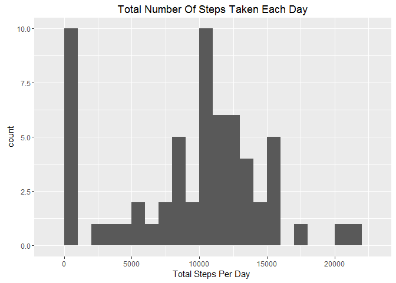
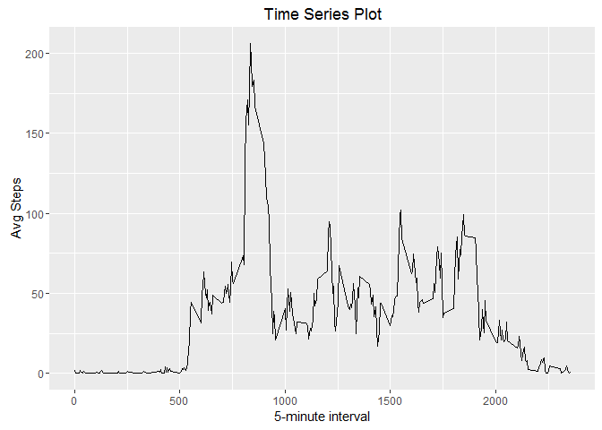
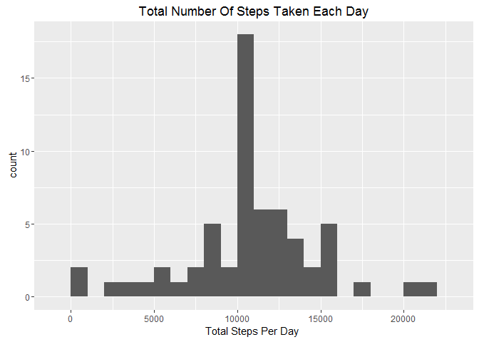
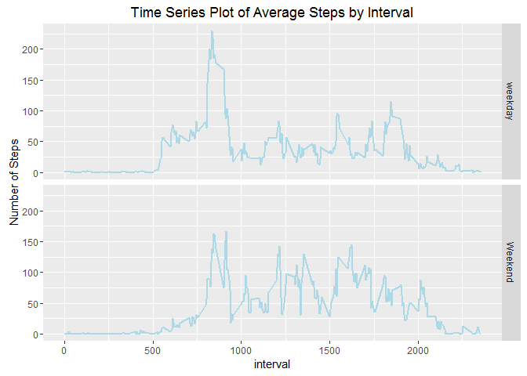

# Reproducible Research: Peer Assessment 1


## Loading and preprocessing the data

#### 1.Load the Data

```r
# Download and Unzip the file
zipFileUrl <- "https://d396qusza40orc.cloudfront.net/repdata%2Fdata%2Factivity.zip"

if(!file.exists("./data")) { dir.create("./data") }
if(!file.exists("./data/activity.zip")) {
  download.file(zipFileUrl, destfile = "./data/activity.zip", mode = "wb")
  unzip(zipfile = "./data/activity.zip", exdir = "./data")
}

activityFile <- "./data/activity.csv"
# Read activity data set
activity <- read.csv(activityFile, header = T, stringsAsFactors = F)
```

#### 2. Transform the Data

```r
activity$date <- as.Date(activity$date, "%Y-%m-%d")
head(activity)
```

```
##   steps       date interval
## 1    NA 2012-10-01        0
## 2    NA 2012-10-01        5
## 3    NA 2012-10-01       10
## 4    NA 2012-10-01       15
## 5    NA 2012-10-01       20
## 6    NA 2012-10-01       25
```
## What is mean total number of steps taken per day?

#### 1.Make a histogram of the total number of steps taken each day

```r
library(dplyr)
library(ggplot2)

stepsPerDay <- activity %>%
  group_by(date) %>% 
  summarize(steps = sum(steps, na.rm=T))


ggplot(stepsPerDay, aes(x=steps)) +
  ggtitle("Total Number Of Steps Taken Each Day") +
  xlab("Total Steps Per Day ") +
  geom_histogram(binwidth = 1000)
```



**Fig. 1:** Histogram of the total number of steps taken each day.

#### 2. Calculate and report the mean and median total number of steps taken per day

```r
# Mean of total number of steps
meanStepsPerDay <- mean(stepsPerDay$steps, na.rm = T)
meanStepsPerDay
```

```
## [1] 9354.23
```

```r
# Median of total number of steps
medianStepsPerDay <- median(stepsPerDay$steps, na.rm = T)
medianStepsPerDay
```

```
## [1] 10395
```

 Mean of total number of steps = meanStepsPerDay
 Median of total number of steps = medianStepsPerDay

## What is the average daily activity pattern?

#### 1.Make a time series plot (i.e. type = "l") of the 5-minute interval (x-axis) and the average number of steps taken, averaged across all days (y-axis)

```r
meanStepsPerInterval <- activity %>%
  group_by(interval) %>% 
  summarize(mean.steps = mean(steps, na.rm=T))

head(meanStepsPerInterval)
```

```
## Source: local data frame [6 x 2]
## 
##   interval mean.steps
##      (int)      (dbl)
## 1        0  1.7169811
## 2        5  0.3396226
## 3       10  0.1320755
## 4       15  0.1509434
## 5       20  0.0754717
## 6       25  2.0943396
```

```r
ggplot(meanStepsPerInterval, aes(interval, mean.steps)) +
  xlab("5-minute interval") +
  ylab("Avg Steps") +
  ggtitle("Time Series Plot") +
  geom_line()
```



#### 2. Which 5-minute interval, on average across all the days in the dataset, contains the maximum number of steps?

```r
intervalWithMaxSteps <- meanStepsPerInterval[which.max(meanStepsPerInterval$mean.steps),][[1]]
intervalWithMaxSteps
```

```
## [1] 835
```


## Imputing missing values

#### 1.Calculate and report the total number of missing values in the dataset (i.e. the total number of rows with NAs)

```r
rowsWithNAs <- sum(is.na(activity$steps))
cat("Number of NA's in the dataset = ", rowsWithNAs)
```

```
## Number of NA's in the dataset =  2304
```


#### 2. Devise a strategy for filling in all of the missing values in the dataset. The strategy does not need to be sophisticated. For example, you could use the mean/median for that day, or the mean for that 5-minute interval, etc.

I will leverage mean for that 5 minute interval

#### 3. Create a new dataset that is equal to the original dataset but with the missing data filled in.

```r
filledActivity <- activity

filledActivity <- filledActivity %>%
  group_by(interval) %>%
  mutate(steps = ifelse(is.na(steps), mean(steps,na.rm=T), steps))

head(filledActivity)
```

```
## Source: local data frame [6 x 3]
## Groups: interval [6]
## 
##       steps       date interval
##       (dbl)     (date)    (int)
## 1 1.7169811 2012-10-01        0
## 2 0.3396226 2012-10-01        5
## 3 0.1320755 2012-10-01       10
## 4 0.1509434 2012-10-01       15
## 5 0.0754717 2012-10-01       20
## 6 2.0943396 2012-10-01       25
```

#### 4.Make a histogram of the total number of steps taken each day and Calculate and report the mean and median total number of steps taken per day. Do these values differ from the estimates from the first part of the assignment? What is the impact of imputing missing data on the estimates of the total daily number of steps?


```r
stepsPerDay <- filledActivity %>%
  group_by(date) %>% 
  summarize(steps = sum(steps))


ggplot(stepsPerDay, aes(x=steps)) +
  ggtitle("Total Number Of Steps Taken Each Day") +
  xlab("Total Steps Per Day ") +
  geom_histogram(binwidth = 1000)
```



```r
# Mean Steps
meanStepsPerDay <- mean(stepsPerDay$steps, na.rm = T)
meanStepsPerDay
```

```
## [1] 10766.19
```

```r
# Median of total number of steps
medianStepsPerDay <- median(stepsPerDay$steps, na.rm = T)
medianStepsPerDay
```

```
## [1] 10766.19
```

Mean and Median values differ from first part of the assigment. 

Effect of imputing missing data on the estimates is that both mean and median are now equal.

## Are there differences in activity patterns between weekdays and weekends?

#### 1.Create a new factor variable in the dataset with two levels - "weekday" and "weekend" indicating whether a given date is a weekday or weekend day.


```r
library(lubridate)

filledActivity$dayOfWeek <- ifelse(wday(filledActivity$date) %in% c(1,7), "Weekend", "weekday")
filledActivity$dayOfWeek <- as.factor(filledActivity$dayOfWeek)

head(filledActivity)
```

```
## Source: local data frame [6 x 4]
## Groups: interval [6]
## 
##       steps       date interval dayOfWeek
##       (dbl)     (date)    (int)    (fctr)
## 1 1.7169811 2012-10-01        0   weekday
## 2 0.3396226 2012-10-01        5   weekday
## 3 0.1320755 2012-10-01       10   weekday
## 4 0.1509434 2012-10-01       15   weekday
## 5 0.0754717 2012-10-01       20   weekday
## 6 2.0943396 2012-10-01       25   weekday
```

dayOfWeek is the new factor variable 

#### 2.Make a panel plot containing a time series plot (i.e. type = "l") of the 5-minute interval (x-axis) and the average number of steps taken, averaged across all weekday days or weekend days (y-axis). See the README file in the GitHub repository to see an example of what this plot should look like using simulated data.

```r
meanStepsPerIntervalOfDayOfWeek <- filledActivity %>%
  group_by(interval, dayOfWeek) %>%
  summarize(avgSteps = mean(steps))

ggplot(meanStepsPerIntervalOfDayOfWeek, aes(interval, avgSteps)) +
  ggtitle("Time Series Plot of Average Steps by Interval") +
  ylab("Number of Steps") +
  facet_grid(dayOfWeek ~ .) +
  geom_line(size = 1, colour = "Light Blue")
```


